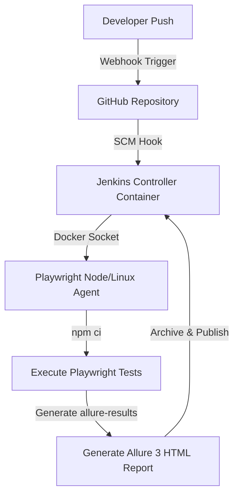

# SauceDemo E2E Automation Framework

A simple end-to-end test automation framework built with **Playwright**, **TypeScript**, and **Allure Report 3** for [SauceDemo](https://www.saucedemo.com).

---

## Tech Stack   

| Tool | Version | Purpose |
|---|---|---|
| [Playwright](https://playwright.dev/) | `^1.49.1` | Browser automation engine with built-in auto-waiting |
| [TypeScript](https://www.typescriptlang.org/) | `^5.x` | Static typing for safer, more maintainable code |
| [Allure Report 3](https://allurereport.org/) | CLI `^3.8.2` / Plugin `^3.9.0` | Rich HTML reports with historical trends and analytics |
| [dotenv](https://github.com/motdotla/dotenv) | `^16.4.7` | Environment variable management |

---

## Project Structure

```
saucedemo-playwright/
├── config/
│   └── env.config.ts             # Central environment configuration
├── pages/                        # Page Object Model (POM) layer
│   ├── BasePage.ts               # Shared navigation and utility methods
│   ├── LoginPage.ts              # Login page locators and interactions
│   ├── InventoryPage.ts          # Product listing and cart badge interactions
│   └── CartPage.ts               # Cart page validation and actions
├── scripts/
│   └── run-with-history.sh       # Multi-run script to build Allure history
├── test-data/                    # Test data, fully separated from test logic
│   ├── login.data.ts             # Credentials and expected error messages
│   └── products.data.ts          # Product names, prices, and identifiers
├── tests/                        # Test specifications
│   ├── login.spec.ts             # Login test suite
│   └── cart.spec.ts              # Cart test suite
├── utils/
│   └── allure.helpers.ts         # Allure 3 step, tag, and severity wrappers
├── allurerc.json                 # Allure 3 configuration (history path setup)
├── playwright.config.ts          # Global Playwright configuration
├── .env                          # Local environment variables (not committed)
├── .env.example                  # Template for setting up .env
└── package.json                  # Scripts and dependencies
```

---

## Architecture Overview

The framework is built in clean, separated layers so each piece has one job and one job only.

```
┌─────────────────────────────────────────────────────────────┐
│                    TEST SPECIFICATIONS                       │
│             login.spec.ts │ cart.spec.ts                     │
│     (test cases, Allure annotations, assertions)             │
└────────────────────┬────────────────────────────────────────┘
                     │ uses
┌────────────────────▼────────────────────────────────────────┐
│                  PAGE OBJECT MODEL (POM)                     │
│      BasePage ──► LoginPage / InventoryPage / CartPage       │
│   (all locators and page interactions live here)             │
└────────────────────┬────────────────────────────────────────┘
                     │ reads from
┌────────────────────▼────────────────────────────────────────┐
│              TEST DATA  &  CONFIGURATION                     │
│    test-data/login.data.ts │ test-data/products.data.ts      │
│    config/env.config.ts    │ .env                            │
└─────────────────────────────────────────────────────────────┘
                     │ reports to
┌────────────────────▼────────────────────────────────────────┐
│                   ALLURE REPORT 3                            │
│   Steps │ Severity │ Epic │ Feature │ Story │ Layer (e2e)    │
└─────────────────────────────────────────────────────────────┘
```

**Why this structure?**
- Test specs stay clean — they only describe *what* to test.
- Page Objects handle *how* to interact with the UI.
- Test data files manage *what data* to use.
- If the UI changes, you update one Page Object, not every test.

---

## Setup & Installation

### Prerequisites
- Node.js v18 or higher
- npm v9 or higher
- Java (required for Allure CLI to generate reports)

### Step 1 — Clone and install

```bash
git clone https://github.com/ChaudharyVishal007/saucedemo-playwright.git
cd saucedemo-playwright
npm install
```

### Step 2 — Install Playwright browsers

```bash
npm run playwright:install
```

### Step 3 — Set up environment variables

```bash
cp .env.example .env
```

The default values in `.env` work out of the box — no changes needed unless you want to run against a different environment.

---

## Running Tests

All tests run in **headless parallel mode** by default on Chromium.

| Command | What it does |
|---|---|
| `npm test` | Run all 25 tests |
| `npm run test:smoke` | Run only `@smoke` tagged tests (critical happy paths) |
| `npm run test:regression` | Run the full `@regression` suite |
| `npm run test:login` | Run only the Login spec |
| `npm run test:cart` | Run only the Cart spec |
| `npm run test:headed` | Run in headed mode (visible browser window) |

To run a specific test by name:

```bash
npx playwright test -g "should login successfully"
```

---

## Allure Report

Allure Report 3 natively accumulates historical trend graphs, stability percentages, and flaky test markers across multiple runs — no extra plugins needed.

### Quickest way (run + generate + open in one command)

```bash
npm run report
```

### Manual steps

```bash
# 1. Run the tests (this produces the raw allure-results/ folder)
npm test

# 2. Generate the HTML report from those results
npm run allure:generate

# 3. Open the report in your browser
npm run allure:open
```

### Building rich history graphs

To fully populate Allure's **Status Dynamics**, **Durations History**, **Status Transitions**, and **Stability** graphs, run the suite multiple times:

```bash
npm run test:history
```

This runs the suite 5 times sequentially. One regression test is intentionally configured to simulate realistic flakiness on runs 2 and 4 — this produces meaningful data in the Allure Stability and Transition graphs, which is useful to demonstrate how the framework would behave in a real CI environment.

---

## Key Design Decisions

### Page Object Model
Every page has its own class extending `BasePage.ts`. All locators use `data-test` attributes — the most stable selectors available on this app — defined once per class. If the UI changes, only the Page Object needs updating, not the tests.

### No Hard Waits
`waitForTimeout()` is never used anywhere in this framework. All synchronisation is handled by Playwright's built-in auto-waiting and assertion retries, keeping tests fast and reliable.

### Decoupled Test Data
No hardcoded strings inside test files. Credentials, error messages, and product details are stored in `test-data/` and imported where needed. This makes data changes trivial and keeps test code readable.

### Allure 3 Annotations
Custom wrappers in `utils/allure.helpers.ts` expose clean functions (`step()`, `severity()`, `feature()`, `story()`) that keep test specs readable and ensure every test is properly labelled in the report.

### Tagging Strategy
- `@smoke` — critical happy paths; meant to run on every deployment
- `@regression` — full coverage; meant to run on pull requests and nightly schedules

### Parallel Execution
`fullyParallel: true` in `playwright.config.ts` ensures tests run at the worker level in parallel. Each test is fully independent, with its own browser context, so there are no shared state issues.

### Retry Logic
- Local runs: 1 retry
- CI runs: 2 retries (controlled by `process.env.CI`)

---

## Test Coverage Summary

### Login (`tests/login.spec.ts`) — 13 tests

**Positive scenarios**
- Successful login with valid credentials (validates URL, page title, browser tab title)
- Login page renders all expected UI elements correctly
- Session persists correctly after a page reload

**Negative scenarios**
- Empty username field shows the correct error
- Empty password field shows the correct error
- Both fields empty shows the correct error
- Locked-out user sees the specific locked-out message
- Wrong username with correct password
- Correct username with wrong password
- Both fields completely wrong
- SQL injection attempt in credentials
- XSS payload attempt in credentials

**Error UI behaviour**
- Error message dismisses cleanly when the X button is clicked
- Error icon/highlight styling appears on both input fields after a failed login

### Cart (`tests/cart.spec.ts`) — 12 tests

**Adding products**
- Adding one product updates the cart badge to 1
- Adding multiple products increments the badge correctly each time
- The "Add to cart" button switches to "Remove" after a product is added

**Cart page validation**
- Navigating to cart shows the correct URL and page title
- Product name and price in the cart match the inventory
- Multiple added products all appear with correct names and prices

**Removing products**
- Removing from the inventory page clears the badge
- Removing from the cart page empties the cart
- Removing one item from a multi-item cart leaves the other item intact
- "Continue Shopping" returns to inventory with the cart badge still showing

**Badge edge cases**
- Badge is not visible when the cart is empty
- Badge disappears after all items are removed

---

## 🚀 CI/CD & Jenkins Pipeline Automation

This framework is fully equipped with a production-ready, lightweight, and modern **Dockerized Jenkins CI/CD pipeline** designed to run tests automatically on code push and generate beautiful interactive **Allure Reports**.

### 🛠️ Architecture Overview



---

### 📦 1. Required Jenkins Plugins

For the pipeline to execute seamlessly, ensure the following plugins are installed via **Manage Jenkins** ➔ **Plugins** ➔ **Available Plugins**:

1. **Docker Pipeline Plugin** (`docker-workflow`): Allows Jenkins to spin up the official Microsoft Playwright container dynamically.
2. **Allure Jenkins Plugin** (`allure-jenkins-plugin`): Aggregates test runs, builds status history graphs, and displays interactive Allure 3 dashboards in the Jenkins UI.
3. **GitHub Integration Plugin** (`github`): Listens for GitHub webhook push notifications to auto-trigger the pipeline.

---

### 🚀 2. Spin Up Jenkins in 1-Click

A pre-configured `docker-compose.yml` and `Dockerfile.jenkins` are provided. Jenkins is set up to run with **Docker-outside-of-Docker (DooD)** capabilities so it can orchestrate Playwright container agents.

#### Start the Jenkins Server
Run the following command from the root directory:
```bash
docker compose up -d --build
```

#### Access Jenkins
- **URL**: `http://localhost:8080`
- **Initial Admin Password**: Retrieve the password from the logs using:
  ```bash
  docker logs jenkins-ci 2>&1 | grep -A 2 "Please use the following password"
  ```
  *(Alternatively, read it directly from the volume)*:
  ```bash
  docker exec jenkins-ci cat /var/jenkins_home/secrets/initialAdminPassword
  ```

---

### ⛓️ 3. Pipeline Configuration Steps

1. **Create the Pipeline Job**:
   - Go to **New Item**, enter `saucedemo-qa-pipeline`, select **Pipeline**, and click **OK**.
2. **Configure General Settings**:
   - Under **Build Triggers**, check **GitHub hook trigger for GITScm polling**.
3. **Configure Pipeline Definition**:
   - In the **Pipeline** section:
     - **Definition**: Select **Pipeline script from SCM**.
     - **SCM**: Select **Git**.
     - **Repository URL**: `https://github.com/ChaudharyVishal007/saucedemo-playwright.git` (or your fork).
     - **Branch Specifier**: `*/qa` (or matching your branch).
     - **Script Path**: `Jenkinsfile`
4. **Save and Run**: Click **Save**.

---

### 🔗 4. GitHub Webhook Setup Steps

To enable automatic execution whenever code is pushed:

1. Go to your **GitHub Repository** ➔ **Settings** ➔ **Webhooks** ➔ **Add webhook**.
2. **Payload URL**: `http://<your-public-jenkins-ip>:8080/github-webhook/`
   > [!NOTE]
   > For local testing, use a tunneling tool like **ngrok** or **localtunnel** to expose your local port `8080` (e.g., `ngrok http 8080`).
3. **Content type**: `application/json`
4. **Which events**: Select **Just the push event**.
5. Click **Add webhook**.

---

### 📊 5. Allure Report Integration

The `Jenkinsfile` automatically manages report building. If you have the **Allure Jenkins Plugin** installed:
1. Go to **Manage Jenkins** ➔ **Tools** ➔ **Allure Report installations...**
2. Name it **Allure** (matching the default, or keep it automatic).
3. Under **Install automatically**, select **Install from Maven Central** (choose the latest 2.x version as it generates all Allure formats flawlessly).
4. The pipeline will automatically compile test outcomes into a stunning interactive widget accessible directly from the build's sidebar menu!

---

### 🔍 6. Setup Verification

To manually verify the pipeline and environment without waiting for a webhook:
1. Open `http://localhost:8080` in your browser.
2. Navigate to your job (`saucedemo-qa-pipeline`).
3. Click **Build Now** to trigger the build manually.
4. Monitor progress via **Console Output** to verify:
   - Code is checked out.
   - The Playwright noble Docker image is pulled.
   - Dependencies are installed using `npm ci`.
   - Tests execute successfully inside the container.
   - The Allure report is generated and archived as a build artifact.

