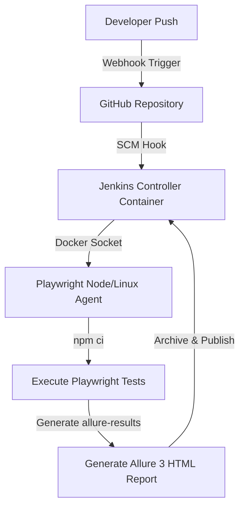

# 🧪 SauceDemo E2E Playwright Automation Framework

[](https://playwright.dev/)
[](https://www.typescriptlang.org/)
[](https://allurereport.org/)
[](https://www.jenkins.io/)

An enterprise-grade, highly optimized end-to-end test automation framework built with **Playwright**, **TypeScript**, and **Allure Report 3** for the [SauceDemo](https://www.saucedemo.com) e-commerce application. It is pre-integrated with a modern, fully containerized **Jenkins CI/CD Pipeline** using Docker Compose.

---

## 🛠️ Architecture & Core Design

The framework is built around solid software engineering principles, employing strict separation of concerns, the Page Object Model (POM), decoupled test data, and zero flaky logic (no hard waits).

```
┌─────────────────────────────────────────────────────────────┐
│                    TEST SPECIFICATIONS                       │
│             login.spec.ts │ cart.spec.ts                     │
│     (test cases, Allure annotations, assertions)             │
└────────────────────┬────────────────────────────────────────┘
                     │ uses
┌────────────────────▼────────────────────────────────────────┐
│                  PAGE OBJECT MODEL (POM)                     │
│      BasePage ──► LoginPage / InventoryPage / CartPage       │
│   (all locators and page interactions live here)             │
└────────────────────┬────────────────────────────────────────┘
                     │ reads from
┌────────────────────▼────────────────────────────────────────┐
│              TEST DATA  &  CONFIGURATION                     │
│    test-data/login.data.ts │ test-data/products.data.ts      │
│    config/env.config.ts    │ .env                            │
└─────────────────────────────────────────────────────────────┘
                     │ reports to
┌────────────────────▼────────────────────────────────────────┐
│                   ALLURE REPORT 3                            │
│   Steps │ Severity │ Epic │ Feature │ Story │ Layer (e2e)    │
└─────────────────────────────────────────────────────────────┘
```

### ⚡ Key Design Decisions

*   **Page Object Model (POM)**: Every web page has its corresponding Page Object class extending `BasePage.ts`. Locators are defined using stable `data-test` attributes to make the tests resilient to UI changes.
*   **No Hard Waits**: Synchronisation is handled completely by Playwright's built-in auto-waiting mechanism and web assertions. `waitForTimeout()` is strictly avoided to maximize run speeds.
*   **Decoupled Test Data**: Credentials, item pricing, and expected error assertions are isolated inside `test-data/` to keep test files fully readable and data modifications trivial.
*   **Allure 3 Metadata**: Custom wrappers in `utils/allure.helpers.ts` inject rich metadata (`severity`, `features`, `stories`, `epics`) without polluting test files with boilerplate annotation logic.
*   **Highly Parallel Execution**: Engineered with `fullyParallel: true` in `playwright.config.ts` to run tests concurrently at the worker level in independent browser contexts.
*   **Smart Retry Strategy**:
    *   **Local Runs**: `1` retry to allow debug evaluation.
    *   **CI Runs**: `2` retries to combat network fluctuations (automatically configured by the `process.env.CI` toggle).

---

## 💻 Tech Stack & Dependencies

| Technology | Purpose | Core Benefits |
| :--- | :--- | :--- |
| **Playwright (`^1.49.1`)** | Automation engine | Auto-waiting, multiple browser contexts, fast execution |
| **TypeScript (`^5.x`)** | Static compilation | Typesafe locators, cleaner refactoring, robust IntelliSense |
| **Allure Report 3 (`^3.8.2`)** | Reporting dashboard | Rich charts, historical dynamics, flaky markers, step tracking |
| **dotenv (`^16.4.7`)** | Configuration management | Secure, environment-specific secret and URL loading |
| **Docker & Jenkins** | Continuous Integration | Standardized container runner, automatic webhook execution |

---

## 📂 Project Structure

```bash
saucedemo-playwright/
├── config/
│   └── env.config.ts             # Central environment configuration loader
├── pages/                        # Page Object Model (POM) layer
│   ├── BasePage.ts               # Base class with shared action utilities
│   ├── LoginPage.ts              # Login authentication locators and actions
│   ├── InventoryPage.ts          # Catalog products and shopping badge actions
│   └── CartPage.ts               # Checkout cart validation page objects
├── scripts/
│   └── run-with-history.sh       # Multi-run script simulating trend history
├── test-data/                    # Isolated test suites datasets
│   ├── login.data.ts             # Valid/invalid credential mock datasets
│   └── products.data.ts          # Catalog inventories expectations (price/names)
├── tests/                        # Playwright E2E spec suites
│   ├── login.spec.ts             # Authentication E2E scenarios (13 test cases)
│   └── cart.spec.ts              # Shopping Cart E2E scenarios (12 test cases)
├── utils/
│   └── allure.helpers.ts         # High-level Allure annotations helpers
├── .env.example                  # Template configuration for project secrets
├── allurerc.json                 # Allure 3 config (history tracking directories)
├── docker-compose.yml            # 1-Click Jenkins service deployment config
├── Dockerfile.jenkins            # Custom Jenkins container with Docker CLI
├── Jenkinsfile                   # Multi-stage CI pipeline logic (Playwright Agent)
├── package.json                  # Task runner scripts & dependencies
└── playwright.config.ts          # Core Playwright execution configurations
```

---

## 🚀 Getting Started (Local Setup)

### 📋 Prerequisites
Ensure you have the following installed locally:
*   **Node.js**: v18 or higher
*   **npm**: v9 or higher
*   **Java**: v8 or higher (required by the Allure CLI to generate HTML reports locally)

### 🔧 1. Clone & Install Dependencies
Clone the **`qa`** branch of the repository (which contains the CI/CD and Allure 3 configurations) and run `npm install`:
```bash
# Clone the 'qa' branch directly
git clone -b qa https://github.com/ChaudharyVishal007/saucedemo-playwright.git

# Navigate into the folder
cd saucedemo-playwright

# Install dependencies with legacy peer deps support
npm install --legacy-peer-deps
```

### 🌐 2. Install Playwright Browsers
Download the required browser binaries (Chromium and Firefox are pre-configured):
```bash
npm run playwright:install
```

### 🔒 3. Configure Environment Variables
Copy the `.env.example` file to create a local `.env` configuration:
```bash
cp .env.example .env
```
> [!NOTE]
> The default values in `.env` are pre-configured to work against SauceDemo out-of-the-box. No modifications are needed to run the suite immediately.

---

## 🏃 Running Tests Locally

All tests run in **headless parallel mode** by default on Chromium.

### 📊 Test Command Matrix

| Command | Action |
| :--- | :--- |
| `npm test` | Executes the entire test suite (25 E2E Tests) |
| `npm run test:smoke` | Runs critical happy paths tagged with `@smoke` |
| `npm run test:regression` | Runs comprehensive coverage tagged with `@regression` |
| `npm run test:login` | Runs authentication test suite exclusively |
| `npm run test:cart` | Runs shopping cart test suite exclusively |
| `npm run test:headed` | Executes tests with visible browser windows (headed mode) |

### 🔍 Filtering Specific Tests
To execute a specific test case matching a substring name:
```bash
npx playwright test -g "should login successfully"
```

---

## 📊 Allure 3 Rich Reporting

This framework is configured with **Allure Report 3** to capture screenshots on failures, record runtime steps, and compile history graphs across sequential runs.

### ⚡ Option A: Run, Generate & Open (Fastest)
Compile results, generate the rich dashboard, and launch it in your default browser in one execution command:
```bash
npm run report
```

### ⚙️ Option B: Step-by-Step Reporting
If you prefer running test suites and building reports individually:
```bash
# 1. Run the test suite (generates raw JSON/JSONL results in allure-results/)
npm test

# 2. Compile raw data into a beautiful static HTML report
npm run allure:generate

# 3. Spin up a local server to view the report
npm run allure:open
```

### 📈 Simulating Historical Trend Graphs
Allure 3 aggregates **Stability**, **Durations History**, and **Status Dynamics** metrics. To view these graphs locally, simulate a series of sequential runs using our preconfigured history shell script:
```bash
npm run test:history
```
> [!TIP]
> This command runs the suite 5 times sequentially. A dedicated regression test is intentionally configured to simulate realistic network/UI flakiness on runs 2 and 4. This produces beautiful, meaningful analytics in the Allure graphs to demonstrate how the framework behaves in real CI environments!

---

## 🧪 Detailed Test Coverage

The suite encompasses **25 complete E2E test scenarios** covering every core customer journey on SauceDemo:

### 🔑 1. Authentication Suite (`tests/login.spec.ts`) — 13 Tests
*   **Positive Scenarios**:
    *   Successful authentication with valid credentials (validates navigation, target URL, main headers, page & browser tab titles).
    *   Validation of session persistence across page reloads.
    *   Clean rendering check of all structural UI forms.
*   **Negative Scenarios**:
    *   Authentication failures on empty username field, empty password field, or both blank.
    *   Validating specific application lockout warnings for locked-out user profiles.
    *   Explicit credentials validation failures (wrong username/correct password, correct username/wrong password, both fields completely wrong).
    *   Sanitization checks: SQL injection payload validation, Cross-Site Scripting (XSS) payload authentication behavior checks.
*   **UI Assertion Boundaries**:
    *   Explicit error indicator styling (red highlight boundaries & error icons) display on input boxes.
    *   Clean dismissal of the credential error message banner when clicking the 'X' button.

### 🛒 2. Shopping Cart Suite (`tests/cart.spec.ts`) — 12 Tests
*   **Product Addition Flows**:
    *   Add single product to cart.
    *   Add multiple products to the cart.
    *   Cart badge updates correctly
    *   “Add to cart” button changes to “Remove”
*   **Cart Inventory Validation**:
    *   Successful navigation validation (URL, headers) to the shopping cart page.
    *   Validation that product names, specific description details, and prices on the cart screen exactly match the selected inventory catalogs.
    *   Multiple item layouts display consistently inside the cart container.
*   **Product Removal Flows**:
    *   Removing products from the home catalog screen clears the cart badge count.
    *   Removing items directly from the checkout cart cleanses the cart.
    *   Removing a single item from a multi-item cart leaves other products fully intact.
    *   Clicking "Continue Shopping" returns users to the catalog, persisting the existing cart items and badge state.
*   **Badge Boundary Conditions**:
    *   Shopping badge indicator is completely hidden when the cart is empty.
    *   Shopping badge disappears instantly after removing the final item.

---

## 🚀 CI/CD & Jenkins Pipeline Automation

This framework is fully equipped with a production-ready, lightweight, and modern **Dockerized Jenkins CI/CD pipeline** designed to run tests automatically on code push and generate beautiful interactive **Allure Reports**.

### 🛠️ CI/CD Architecture Flow



### 📦 1. Required Jenkins Plugins
For the pipeline to execute, ensure the following plugins are installed under **Manage Jenkins** ➔ **Plugins** ➔ **Available Plugins**:
1.  **Docker Pipeline Plugin** (`docker-workflow`): Allows Jenkins to spin up the official Microsoft Playwright container dynamically.
2.  **Allure Jenkins Plugin** (`allure-jenkins-plugin`): Aggregates test runs, builds status history graphs, and displays interactive Allure 3 dashboards in the Jenkins UI.
3.  **GitHub Integration Plugin** (`github`): Listens for GitHub webhook push notifications to auto-trigger the pipeline.

### 🚀 2. Spin Up Jenkins in 1-Click
We provide a preconfigured docker-compose file that mounts the host's Docker socket to authorize containerized agents.

> [!IMPORTANT]
> **Prerequisite — Docker Engine Running**: Ensure that the Docker daemon (Docker Desktop) is running on your host machine before attempting to spin up Jenkins. 
> * **On macOS**: Press `Cmd + Space`, search for **Docker Desktop**, and launch it. Wait until the status bar whale icon turns solid green (**"Running"**).
> * **On Windows**: Open **Docker Desktop** from the Start Menu.
> * **On Linux**: Ensure the systemd service is active: `sudo systemctl start docker`.

#### Start the Jenkins Server:
```bash
docker compose up -d --build
```

#### Access Jenkins UI:
*   **URL**: `http://localhost:8080`
*   **Initial Admin Password**: Retrieve the generated password from logs:
    ```bash
    docker logs jenkins-ci 2>&1 | grep -A 2 "Please use the following password"
    ```
    *(Alternatively, print it directly from the volume)*:
    ```bash
    docker exec jenkins-ci cat /var/jenkins_home/secrets/initialAdminPassword
    ```

### ⛓️ 3. Pipeline Configuration Steps
1.  **Create Pipeline**: Go to **New Item**, enter `saucedemo-qa-pipeline`, select **Pipeline**, and click **OK**.
2.  **Trigger Configurations**: Check **GitHub hook trigger for GITScm polling**.
3.  **Pipeline script from SCM**:
    *   **Definition**: `Pipeline script from SCM`
    *   **SCM**: `Git`
    *   **Repository URL**: `https://github.com/ChaudharyVishal007/saucedemo-playwright.git` (or your repository fork).
    *   **Branch Specifier**: `*/qa`
    *   **Script Path**: `Jenkinsfile`
4.  **Save**: Click **Save**.

### 🔗 4. GitHub Webhook Setup Steps

To trigger the pipeline automatically in real-time on code push:

1.  Go to your **GitHub Repository** ➔ **Settings** ➔ **Webhooks** ➔ **Add webhook**.
2.  **Payload URL**: Enter your public Jenkins URL followed by `/github-webhook/` (e.g., `https://<your-public-url>/github-webhook/`).
    
    > [!TIP]
    > **Local Testing (Zero-Signup Webhooks)**:
    > Since GitHub cannot access `localhost`, use one of these completely free, login-free tunneling tools to expose your local port `8080`:
    > * **Option A — `localtunnel` (Requires Node.js)**:
    >   ```bash
    >   npx localtunnel --port 8080
    >   ```
    > * **Option B — `pinggy` (Zero installation, uses SSH)**:
    >   ```bash
    >   ssh -R 80:localhost:8080 free.pinggy.io
    >   ```
    > Copy the generated public URL from your terminal and use it as your Payload URL (e.g., `https://slimy-frogs-jump.loca.lt/github-webhook/`).
    
    > [!NOTE]
    > **Alternative: SCM Polling (No Internet exposure needed!)**:
    > If you do not want to expose your local port to the internet, configure SCM Polling in Jenkins. Check **Poll SCM** under **Build Triggers** in your Jenkins Pipeline, and enter `* * * * *` as the Schedule to scan GitHub for updates every minute.

3.  **Content type**: `application/json`
4.  **Which events**: Select **Just the push event**.
5.  Click **Add webhook**.

### 📊 5. Allure Report Integration in Jenkins

> [!IMPORTANT]
> **Prerequisite**: You must install the **Allure Jenkins Plugin** first (under **Manage Jenkins** ➔ **Plugins** ➔ **Available Plugins**) before the **Allure Report installations** option will show up in the Tools menu!

Once the plugin is installed:
1.  Go to **Manage Jenkins** ➔ **Tools** (scroll down to **Allure Report installations...**).
2.  Click **Add Allure Report**.
3.  Name it **Allure** (the `Jenkinsfile` refers to this specific name).
4.  Under **Install automatically**, select **Install from Maven Central** and choose the latest version (e.g., `2.29.0` or latest 2.x).
5.  Click **Save**. The pipeline will now build stunning report widgets directly in the build sidebar!

### 🔍 6. Manual Setup Verification
To manually test the pipeline without waiting for a commit push:
1.  Open `http://localhost:8080` and click on `saucedemo-qa-pipeline`.
2.  Click **Build Now** to manually trigger the execution pipeline.
3.  Open the active build's **Console Output** to verify:
    *   Code is successfully checked out from the `qa` branch.
    *   The `playwright` noble Docker container is pulled.
    *   Dependencies are installed using `npm ci --legacy-peer-deps`.
    *   Playwright tests execute inside the container agent.
    *   Allure reports are compiled and published successfully.

---

## 🛠️ Troubleshooting & Team Tips

Here are the most common pitfalls and solutions for team members setting up the CI/CD pipeline locally:

### 🔑 1. I skipped setting up an Admin account, and now I'm locked out!
If you click **"Skip and continue as admin"** during the Jenkins setup, Jenkins automatically creates a default administrator profile:
* **Username**: `admin`
* **Password**: Your initial admin password (retrieve it via `docker logs jenkins-ci`).

If you are completely locked out, you can temporarily disable security to reset your credentials:
1. Run: `docker exec -it jenkins-ci sed -i 's/<useSecurity>true<\/useSecurity>/<useSecurity>false<\/useSecurity>/g' /var/jenkins_home/config.xml`
2. Run: `docker restart jenkins-ci`
3. Access `http://localhost:8080` without a password, set your new password in **Manage Jenkins ➔ Users**, and then run:
4. `docker exec -it jenkins-ci sed -i 's/<useSecurity>false<\/useSecurity>/<useSecurity>true<\/useSecurity>/g' /var/jenkins_home/config.xml`
5. Run: `docker restart jenkins-ci` to turn security back on!

### 🐳 2. Playwright says: "Executable doesn't exist... Please update docker image"
Playwright strictly requires the version of the `@playwright/test` npm package in `package.json` to **exactly match the browser binaries inside the running Docker container**.
* **Rule**: If you upgrade Playwright in `package.json` (e.g., to `1.60.0`), you **must** update the Docker image tag in the **`Jenkinsfile`** to match (e.g., change `v1.49.1-noble` to `v1.60.0-noble`).
* **Tip**: We have locked the local devDependency in `package.json` to exactly `"1.49.1"` to prevent unintended upgrades from breaking your builds in the future.

### 📦 3. Strict peer dependency conflicts (`ERESOLVE`) on `npm install`
Because some reporting packages (like Allure) declare different Playwright peer versions, modern npm versions might throw peer conflicts.
* **Solution**: Always use the `--legacy-peer-deps` flag:
  ```bash
  npm install --legacy-peer-deps
  ```
  The pipeline is preconfigured to use `npm ci --legacy-peer-deps` to guarantee clean, error-free builds!

